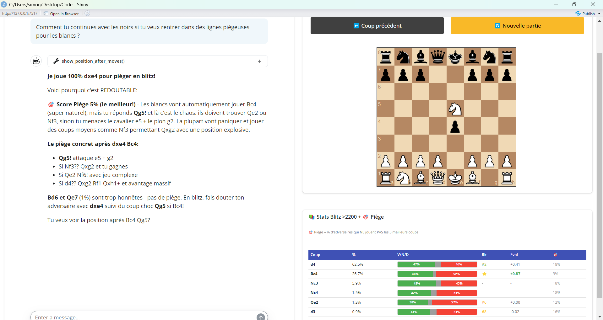

# ♟️ BlitzTrap

**AI-powered chess coach specialized in finding traps for blitz games**



## 🎯 What is BlitzTrap?

BlitzTrap is an R Shiny application that helps you find the best **trappy moves** in chess openings. It combines:

- **Lichess database** statistics (2200+ blitz games)
- **Stockfish cloud evaluation**
- **AI coaching** powered by Claude (Anthropic)
- A unique **Trap Score** that shows how likely your opponent is to make a mistake

## ✨ Key Features

### 🎯 Trap Score
The killer feature! For each move, BlitzTrap calculates the percentage of opponents who **don't play one of the top 3 best responses**. A high trap score (>40%) means your opponent is very likely to go wrong!

### 📊 Statistics Dashboard
- Win/Draw/Loss percentages for each move
- Stockfish evaluation and ranking
- Percentage of games where each move is played

### 🤖 AI Coach
An integrated AI chess coach (2400+ level) that:
- Explains the ideas behind moves
- Suggests aggressive, practical plans
- Can display positions after move sequences
- Specializes in blitz tactics and traps

### ♟️ Interactive Board
- Drag-and-drop pieces
- Undo moves
- Reset to starting position

## 🚀 Installation

### Prerequisites

```r
install.packages(c("shiny", "bslib", "shinychat", "ellmer", "httr", "jsonlite"))
```

### API Key

You need an Anthropic API key for the AI coach feature:

```r
Sys.setenv(ANTHROPIC_API_KEY = "your-api-key-here")
```

### Run the app

```r
shiny::runApp("app.R")
```

## 📖 How to Use

1. **Make moves** on the board by dragging pieces
2. **Check the stats table** to see:
   - Popular moves and their win rates
   - Stockfish rankings (⭐ = best move)
   - 🎯 Trap scores (highlighted in orange = best trap)
3. **Ask the AI coach** questions like:
   - "Comment tu continues avec les noirs pour piéger?"
   - "Show me the position after dxe4 Bc4 Qg5"
   - "What's the plan here?"

## 🔧 Technical Details

- **Frontend**: Shiny + bslib + chessboard.js + chess.js
- **AI**: Claude Sonnet via ellmer/shinychat
- **APIs**: 
  - Lichess Explorer API (opening statistics)
  - Lichess Cloud Eval API (Stockfish analysis)

## 📄 License

MIT License - Feel free to use and modify!

## 🙏 Credits

- [Lichess](https://lichess.org) for their amazing free APIs
- [chessboard.js](https://chessboardjs.com) for the board UI
- [Anthropic](https://anthropic.com) for Claude AI
